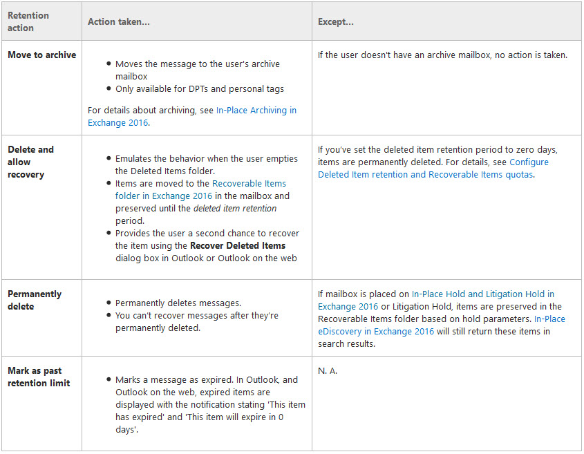
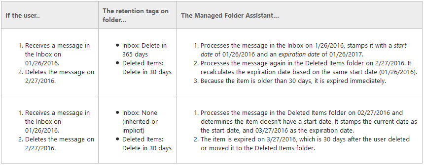
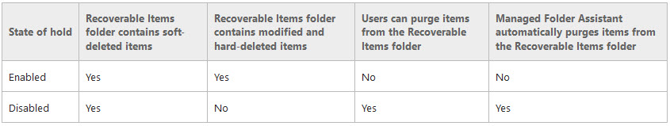

When it comes to the topic of Litigation Hold, Legal is often involved and getting it "right" has a vital meaning. 
In this case, Information Technology (IT) has two objectives: Implentation and being able to describe complex technology
topics to various individuals in a simple, down to earth manner. 

Today, I hope to breifly introduce the topics of Email Retention and Litigaiton Hold for Exchange Online 
(Office 365) in a simple, yet informative, manner.

**Standard Disclaimer**: This information is given for technical education only. It may not work for 
your specific situation. It is not professional advice, and I am not a certified professional with Office 365
or Exchange Online. You may have to find and hire a Microsoft certified professional to get technical advice 
to help assist with these topics. You may also wish to hire an attorney to help with any legal questions 
that could arise from the topics at hand as I am not a lawyer nor have any legal education from an accredited institution.

Okay, with that away, shall we begin... 

# Retention Policy On Mailboxes 

To start off, a __retention policy__ is a method of data management on a mailbox to remove items at a certain 
time frame. For example, the Inbox folder may have indefinite time frame of not removing content where as 
the “Deleted Items” folder may have a retention time frame of item removal of 30 days. Different retention 
policies may be assessed on individuals or groups of users, however only one retention policy may be assigned 
on a Mailbox. The calculation of item removal on folders is defined by Retention tags. 

A __retention tag__ contains a definition of a time limit, often referred to as the retention period, and 
for a specific action to be taken when that time limit is reached. The retention period is the length of 
time after an item arrives or is created before an action is taken (note: certain caveats exist for this 
explanation to be explained later below).  

In the Exchange environment, or in our case Office 365, there are three main types of 
[retention tags](https://technet.microsoft.com/en-us/library/dd297955(v=exchg.160).aspx "Retention tags and retention policies in Exchange 2016"):
1.	__Default Policy Tag (DPT)__ – Every retention policy has a DPT tag. Only one DPT may exist.  This 
tag applies the default retention period for all items that are not defined in any retention policy tags. 
2.	__Retention Policy Tags (RPTs)__ – Retention periods for [default folders](https://technet.microsoft.com/en-us/library/dn783294(v=exchg.160).aspx 
"Default folders that support Retention Policy Tags") (e.g. Inbox, Deleted Items, Sent Items, etc.) that 
may be defined for different time intervals outside of the scope of a DPT. 
3.	__Personal Tags__ – [User defined rules](https://support.office.com/en-us/article/Assign-retention-policy-to-email-messages-3e5fd2dc-633f-4a38-b313-b31b81f7cf7a 
"Assign Retention policy to email messages") for folders and items for an action to be performed at an interval 
of the Users choosing that does not supersede a defined interval period of the DPT or RPT(s).

A retention tag is configured with a __retention action__: Archive, Delete and Allow Recovery, or Permanently delete. 

(Image captured from [Microsoft Retention Technet Documentation Page](https://technet.microsoft.com/en-us/library/dd297955(v=exchg.160).aspx "subheading 'Retention actions'"))

After the retention policy is assigned to the Mailbox, a continuous process running in the background named 
__“Managed Folder Assistant (MFA)”__ assesses the policy tags on all the items in the Mailbox. While the 
Managed Folder Assistant is always running, it may take up to a 7 days for all items to be processed with 
the Policy Retention tag and their respective actions. If forcing the 
[Managed Folder Assistant](https://support.office.com/en-us/article/Set-up-an-archive-and-deletion-policy-for-mailboxes-in-your-Office-365-organization-ec3587e4-7b4a-40fb-8fb8-8aa05aeae2ce "Step 5") 
to run on an individual mailbox via a PowerShell command, 

    Get-Mailbox -Identity $identity | Start-ManagedFolderAssistant

it may lessen this time for the tags to apply to items in the 
mailbox but can still take up to 48 hours for items to be appropriately tagged with the retention policy.

After the Managed Folder Assistant processes the items, it will calculate a retention age. If the items have 
a retention tag, the MFA tests the age of the various items. If an item has exceeded its __retention age__, 
it takes the specified retention action. Retention age is determined by MFA process stamping an item with a 
start date and an expiration date for all items that have a retention tag set with retention action Delete 
and Allow recovery or Permanently delete. Here are some examples to help illustrate a theoretical scenario:

(Image captured from [Microsoft Technet Page, How retention age is calculated in Exchange 2016](https://technet.microsoft.com/en-us/library/bb430780(v=exchg.160).aspx))

__*Important Note*__: In the second example, since no retention tag was assigned to the Inbox folder with a 
retention tag action of _Delete and Allow Recovery_ **or** _Permanently delete_, the item received in the example 
was never stamped by the MFA process with a start date or an expiration date. This changed once it was moved 
to a location, Deleted Items, that did have a retention tag with an retention action thus causing the MFA 
process to assign the initial start date for calculating the retention age of the item for it to expire. 
This important to understand when implementing a retention policy for "gotchas" on why items may still exist in 
the Mailbox.

### In Summary
A mailbox may have one retention policy assigned that consists of Default Policy Tag (all items that do not have
a retention policy tag assigned), possible Retention Policy Tags (default folder items with specific retention periods), 
and Possible Personal Tags (User defined tags) that perform a specified Retention Action. The MFA will process the items 
to execute the retention actions. See graphic below from Microsoft:

## Deletions
Moving onto __deletions__, Exchange Online (or Office 365), handles deletions in a certain methodology. To 
remove an item may mean a few things: 

* __Delete__ – Describes when an item is deleted from any folder and placed in the “Deleted Items” default folder 
* __Soft delete__ – Describes when an item is deleted from the Deleted Items default folder and placed in the 
[Recoverable Items folder](https://technet.microsoft.com/en-us/library/ee364755(v=exchg.160).aspx "Recoverable Items folder in Exchange 2016"). 
Also describes when an Outlook user deletes an item by pressing Shift + Delete, which bypasses the Deleted Items default folder and places the 
item directly in the Recoverable Items folder.
* __Hard delete__ – Describes when an item is marked to be purged from the mailbox database. This is also known
as a store hard delete.

A mailbox consists of two locations: a visible location such as Inbox, Calendar, and Deleted Items 
(Interpersonal messaging [[IPM] subtree](https://msdn.microsoft.com/en-us/library/office/cc842314.aspx) ) 
and a hidden location (non-IPM subtree). One location in the non-IPM subtree is the Recoverable Items folder. The Recoverable items folder 
while not visible to Outlook users is visible when performing eDiscovery operations. The Recoverable Items folder consists of: 
* Deletions – all items deleted from the Deleted Items default folder (the folder visible in Outlook)
* Versions If In-Place Hold or Litigation Hold is enabled, this subfolder contains the original and modified copies of the deleted items 
* Purges – If either Litigation Hold or single item recovery is enabled, this subfolder contains all items that are hard deleted. 
* Audits – If mailbox audit logging is enabled for a mailbox, this subfolder contains the audit log entries. 
* DiscoveryHolds – If In-Place hold is enabled, this subfolder contains all items that meet the hold query parameters and are hard deleted. 
* Calendar Logging – This subfolder contains calendar changes that occur within the mailbox. 

See graphic below from Microsoft on deletions: 

#### In summary
Deletions have two locations: the "Deleted Items" default folder and the "Recoverable Items Folder." The "Deleted Items" folder 
is visible. The "Recoverable Items Folder" is hidden but may be searched via 
[eDiscovery](https://support.office.com/en-us/article/Manage-eDiscovery-cases-in-the-Office-365-Security-Compliance-Center-9a00b9ea-33fd-4772-8ea6-9d3c65e829e6
"Manage eDiscovery cases in the Office 365 Security & Compliance Center") or 
[recovered by users](https://support.office.com/en-us/article/Recover-deleted-items-in-Outlook-for-Windows-49e81f3c-c8f4-4426-a0b9-c0fd751d48ce?ui=en-US&rs=en-US&ad=US
"Recover deleted items in Outlook for Windows"). 

# Litigation Hold on Mailboxes
A [Litigation Hold](https://technet.microsoft.com/en-us/library/ff637980(v=exchg.160).aspx "In-Place Hold and Litigation Hold in Exchange 2016") 
is a way an organization may retain or preserve electronically stored information (ESI) on a mailbox 
(note: focus is on Exchange Online or Office 365). A Litigation hold prevents Exchange users from accidently 
or maliciously permanently deleting content. Placing a mailbox on Litigation hold is as easy as:

    Set-Mailbox -Identity $identity -LitigationHoldEnabled $true

When an Outlook user deletes an item from the Deleted Items folder, that is a _soft delete_, the item is transitioned to 
the Recoverable Items folder thus disappearing from the User’s view. However, by placing a mailbox on In-Place or Litgation 
hold this in turn stops the MFA from automatically purging messages from the DiscoveryHolds and Purges subfolders. Below are the actions 
that can be performed in the Recoverable Items folder if Litigation hold is enabled:

(Again, Image credits go to [Microsoft Retention Technet Documentation Page](https://technet.microsoft.com/en-us/library/ee364755(v=exchg.160).aspx#hold))

### In summary
A mailbox on Litigation Hold prevents the items that are specified in the hold from being deleted and transitions them to a hidden folder 
location called “Recoverable Items”

#### Last Minute Additional Notes
Okay, if you have read to this point here are couple more things to explore:
1. [Inactive Mailboxes](https://support.office.com/en-us/article/Manage-inactive-mailboxes-in-Office-365-296a02bd-ebde-4022-900e-547acf38ddd7 
"Manage inactive mailboxes in Office 365") - In Office 365, if you delete a Mailbox that has Litigation Hold enabled 
the contents of that mailbox do not automatically get removed. Instead, the Mailbox will go into an Inactive status 
and are eDiscoverable for the duration of the hold (when initially applied).
2. [Recoverable Items Quota](https://support.office.com/en-us/article/Increase-the-Recoverable-Items-quota-for-mailboxes-on-hold-a8bdcbdd-9298-462f-b889-df26037a990c
"Increase the Recoverable Items quota for mailboxes on hold") - Just like Mailbox Quotas, the Recoverable Items Folder also has a quota. The storage quota on the 
Recoverable Items Folder does increase to 100GB if a Mailbox is placed on hold. Nonetheless, the quota may be a serious concern for some Mailboxes.

Okay, that's all folks. 

Jeremiah
