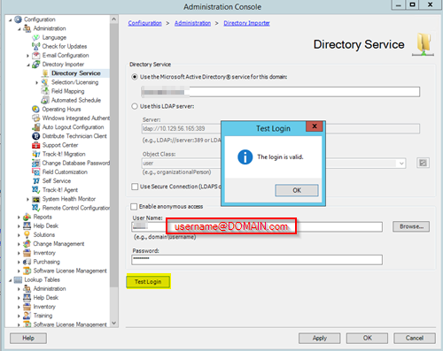

After updating to Track-It! 11.4 Service Pack 2, the directory importer no longer functioned. I got the following error:  
```An invalid configuration was detected for directory service DOMAIN```
and 
```The login credentials could not be authenticated for the specified directory service. To use a secure connection, import the CA certificate into the local computer's "Trusted Root" certificate store.```

## The Fix
The issue was due to the username being in the **domain**\username format. To restore functionality of the directory importer you need to change this to username@**domain**.com. 

To do this: 

1. Launch the Track-It! Technician Client as an Administrator 
2. Select **Tools > Administration Console > Configuration > Administration > Directory Importer > Directory Service**
3. Update your username to be in the format username@DOMAIN.com or username.

