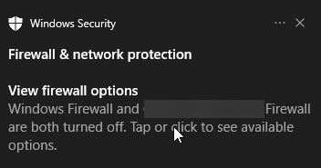
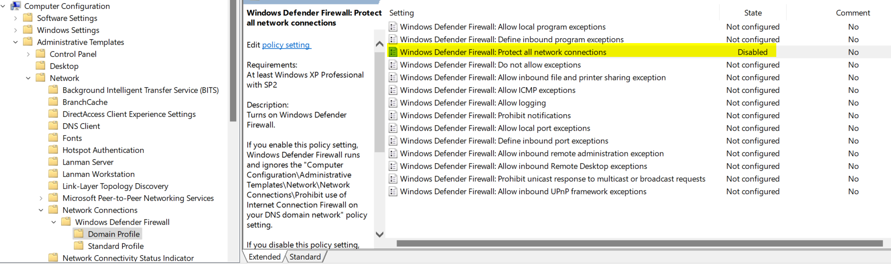

C'mon Microsoft! I just want to turn off the Windows Firewall without a pesky message informing me on every login that this is done. Yes, I understand the action being performed.  

Now before you grab your pitchfork, I believe many reasons exist to disable the Windows Firewall. 
Primarily, if you have an endpoint security solution that handles 
this defense of network traffic.

Equally, many reasons exist NOT to disable the Windows Firewall. If the 
only firewall in your Infrastructure exists at the edge or perimeter then you may wish to 
keep enabled. A host solution is pivotal. After all, you want all the security options that are at your disposal.

**Before Implementation:** I highly suggest reviewing your defense in depth strategy to verify network traffic is secure.  
{: .notice--warning}  

Okay, with that out of the way let's begin. The problem being faced was an annoying Windows toast notification continuously letting End Users know 
that the built in Firewall was disabled. The messages:  

> Turn on Windows Firewall: Windows Firewall is turned off.  

and 

> Firewall & network protection: Windows Firewall and __provider__ are both turned off. Tap or click to see available options.  

  

Yes, this is _true_. Network traffic is being tunneled through our security solution (verified via a Wireshark packet capture) so 
the Windows Firewall was of no use and was in turn disabled. As such, this particular notification was of negative value. A solution to keep the security solution 
notifications enabled while disabling the Windows Defender notifications was the goal. 

## Disabling Windows Firewall (and Notifications)    

A couple of options: 
1. Via GPO  
2. Via registry modification  

### Group Policy  
For the Group Policy method, configure the applicable profiles:  

    Computer Configuration>Administrative Templates>Network>Network Connections>Windows Defender Firewall>Domain Profile/Standard Profile  

* Windows Defender Firewall: Protect all network connections -- Domain Profile -- **Disabled**
* Windows Defender Firewall: Protect all network connections -- Standard Profile -- **Disabled**  

  

### PowerShell  
Alternatively, if you are distributing via Intune or other deployment mechanism, then you may wish to do the above via 
a registry modificaiton.  

```powershell
# Domain Profile  
New-ItemProperty -LiteralPath 'HKLM:\SOFTWARE\Policies\Microsoft\WindowsFirewall\DomainProfile' -Name 'EnableFirewall' -Value 0 -PropertyType Dword -Force -ea SilentlyContinue  
# Standard Profile  
New-ItemProperty -LiteralPath 'HKLM:\SOFTWARE\Policies\Microsoft\WindowsFirewall\StandardProfile' -Name 'EnableFirewall' -Value 0 -PropertyType Dword -Force -ea SilentlyContinue  
```  

## Final Thoughts  
I hope this post was useful. With your new found green checkmark next to disabled firewall 
in the network & security settings, it is extra important to review your network security stack.  

Again, I highly suggest keeping the Windows Firewall enabled if it is your only host solution. With that said, many 
situations exist where this is not needed.  

Until next time,  
Cheers  
